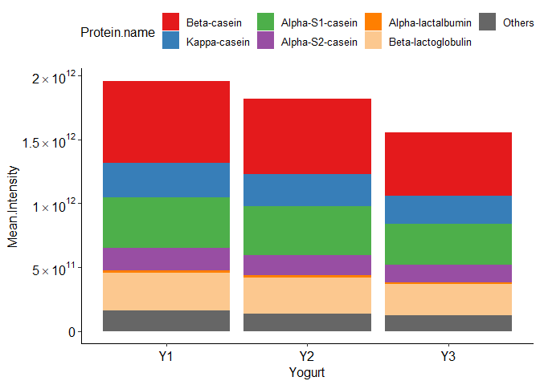
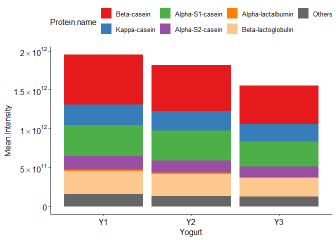
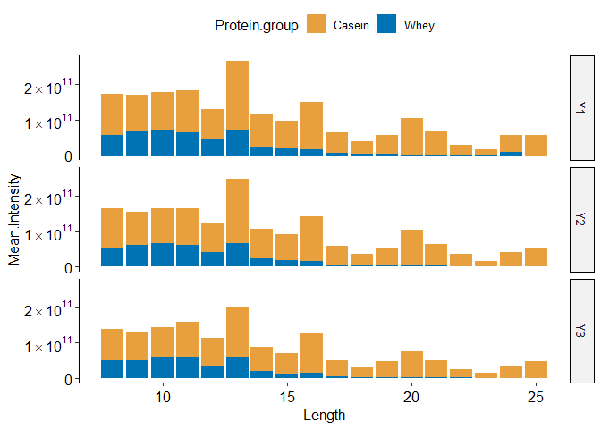

peptidomicsR
================

**Tools for peptidomics analysis of digesta from protein digestion**

`peptidomicsR` provides functions to process, filter, analyze, and
visualize peptidomics data, especially from MaxQuant protein digestion
studies. This README introduces the package through three parts:

✨ **Functions**

🚀 **Example analysis workflow**

📊 **Example plots**

------------------------------------------------------------------------

## ✨ Functions

### Data processing — `processPeptides()`

- Import MaxQuant *peptides* file, intensity-column metadata, and
  protein mapping.
- Automatically remove contaminants and reverse sequences.
- Compute replicate- and group-level mean intensities and peptide
  counts.
- Map parent protein name and protein group for each peptide.
- Calculate peptide GRAVY scores.

### Filtering & statistics

- **PCA** analysis to pre-check group separation — `pcaPeptides()`.
- Subset by sequence, regex pattern, or grouping variables —
  `filterPeptides()`.
- Compare specific groups using statistical analysis to identify
  significantly different peptides with — `ttestPeptides()`.

### Visualization

- Stacked bar plots of **peptide intensities** by parent proteins —
  `plot_int()`.
- Stacked bar plots of **peptide counts** by parent proteins —
  `plot_count()`.
- **Peptide-length distribution** (by intensity or counts) —
  `plot_length_distribution()`.
- **Cleavage-site** intensity (N/C/both termini) —
  `plot_cleavage_site()`.
- **GRAVY vs. intensity** scatter — `plot_gravy_vs_intensity()`.
- **PCA** plot to quickly assess group separation —
  `plot_pcaPeptides()`.
- **Volcano plot(s)** for differential tests (t.test or limma) —
  `plot_volcano()`.

------------------------------------------------------------------------

## 🚀 Example analysis workflow

1.  Import and process data → `processPeptides()`
2.  Explore distributions:
    - Intensities → `plot_int()`
    - Counts → `plot_count()`
    - Length distribution → `plot_length_distribution()`
    - Cleavage sites → `plot_cleavage_site()`
    - Hydrophobicity trends → `plot_gravy_vs_intensity()`
3.  Filter subsets of peptides → `filterPeptides()`
4.  Perform statistical comparisons → `ttestPeptides()`
5.  Visualize results → `plot_volcano()`

------------------------------------------------------------------------

## 📦 Installation

``` r
# Install from GitHub
if (!require("devtools")) install.packages("devtools")
devtools::install_github("xchuam/peptidomicsR")

if (!requireNamespace("BiocManager", quietly = TRUE)) install.packages("BiocManager")
BiocManager::install("limma")
```

------------------------------------------------------------------------

## 📊 Example plots

> This is only a small sample of the functions included in the
> package!  
> For a complete list, please check the package vignette.

### 1) Import and process data

``` r
library(peptidomicsR)

result <- processPeptides(
  peptides_file          = "Data/Yogurtexample_QR188-205.csv",
  intensity_columns_file = "Data/Intensity_columns.csv",
  protein_mapping_file   = "Data/protein_mapping.csv"
)
```

### 2) Mean peptide intensities by parent proteins

<!-- -->

### 3) Peptide-length distribution (by intensity)

``` r
plot_length_distribution(
  result,
  facet_rows    = "Yogurt",
  filter_params = list(Digest.stage = "G120")
)
```

<!-- -->

### 4) Cleavage-site intensity (N and/or C termini)

``` r
plot_cleavage_site(
  result,
  terminal              = "both",       # "N", "C", or "both"
  measure               = "intensity",  # "intensity" or "count"
  replicate_mode        = "mean",       # "mean" or "reps"
  filter_params         = list(Digest.stage = "G120"),
  scientific_10_y       = TRUE,
  drop_constant_groups  = TRUE
)
```

<!-- -->

------------------------------------------------------------------------

## 🛠️ Dependencies

`data.table`, `ggplot2`, `ggpubr`, `scales`, `cowplot`, `gridExtra`,
`ggseqlogo`, `limma` (plots & helpers)

------------------------------------------------------------------------

## 📖 Citation

If you use **peptidomicsR** in your work, please cite this repository:

*Ma, X., & Ren, Q. (2025). peptidomicsR (Version 0.1.0) \[Computer
software\]*

------------------------------------------------------------------------

## 📜 License

This project is licensed under the **GPL-3.0 License** – see the
`LICENSE` file for details.
