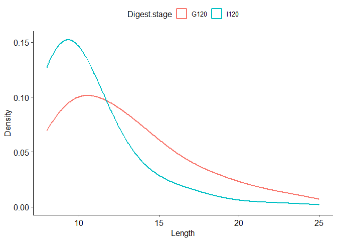

peptidomicsR
================

**Tools for peptidomics analysis of digesta from protein digestion**

`peptidomicsR` provides functions to process, filter, analyze, and
visualize peptidomics data, especially from MaxQuant protein digestion
studies. This README introduces the package through four parts:

✨ **Functions**

🚀 **Example analysis workflow**

📊 **Example plots**

🛠️ **Required input file**

------------------------------------------------------------------------

## 📦 Installation

``` r
# Install from GitHub
if (!require("devtools")) install.packages("devtools")
devtools::install_github("xchuam/peptidomicsR")

if (!requireNamespace("BiocManager", quietly = TRUE)) install.packages("BiocManager")
BiocManager::install("limma")
```

------------------------------------------------------------------------

## ✨ Functions

### 1) Data processing — `processPeptides()`

- Import MaxQuant *peptides* file, intensity-column metadata, and
  protein mapping.
- Automatically remove contaminants and reverse sequences.
- Compute replicate- and group-level mean intensities and peptide
  counts.
- Map parent protein name and protein group for each peptide.
- Calculate peptide GRAVY scores.

### 2) Filtering & statistics

- **PCA** analysis to pre-check group separation — `pcaPeptides()`.
- Subset by sequence, regex pattern, or grouping variables —
  `filterPeptides()`.
- Compare specific groups using statistical analysis to identify
  significantly different peptides with — `ttestPeptides()`.

### 3) Visualization

- Stacked bar plots of **peptide intensities** by parent proteins —
  `plot_int()`.
- Stacked bar plots of **peptide counts** by parent proteins —
  `plot_count()`.
- **Peptide-length distribution** (by intensity or counts) —
  `plot_length_distribution()`.
- **Cleavage-site** intensity (N/C/both termini) —
  `plot_cleavage_site()`.
- **GRAVY vs. intensity** scatter — `plot_gravy_vs_intensity()`.
- **PCA** plot to quickly assess group separation —
  `plot_pcaPeptides()`.
- **Volcano plot(s)** for differential tests (t.test or limma) —
  `plot_volcano()`.

------------------------------------------------------------------------

## 🚀 Example analysis workflow

1.  Import and process data → `processPeptides()`
2.  Explore distributions:
    - Intensities → `plot_int()`
    - Counts → `plot_count()`
    - Length distribution → `plot_length_distribution()`
    - Cleavage sites → `plot_cleavage_site()`
    - Hydrophobicity trends → `plot_gravy_vs_intensity()`
3.  Filter subsets of peptides → `filterPeptides()`
4.  Perform statistical comparisons → `ttestPeptides()`
5.  Visualize results → `plot_volcano()`

------------------------------------------------------------------------

## 📊 Example plots

> This is only a small sample of the functions included in the
> package!  
> For a complete list, please check the package vignette.

### 1) Import and process data

``` r
library(peptidomicsR)

result <- processPeptides(
  peptides_file          = "Data/Yogurtexample_QR188-205.csv",
  intensity_columns_file = "Data/Intensity_columns.csv",
  protein_mapping_file   = "Data/protein_mapping.csv"
)
```

### 2) Mean peptide intensities by parent proteins

``` r
plot_int(
  result,
  x_var         = "Yogurt",
  type          = "mean",
  filter_params = list(Digest.stage = "G120"),
  color_by      = "Protein.name"
)
```

<!-- -->

### 3) Peptide-length distribution (by intensity)

``` r
plot_length_distribution(
  result,
  facet_rows    = "Yogurt",
  filter_params = list(Digest.stage = "G120")
)
```

<!-- -->

``` r
plot_length_distribution(
  result,
  metric = "count",
  filter_params = list(Yogurt = "Y1"),
  plot_mode = "density"
)
```

<!-- -->

### 4) Cleavage-site intensity (N and/or C termini)

``` r
plot_cleavage_site(
  result,
  terminal              = "both",       # "N", "C", or "both"
  measure               = "intensity",  # "intensity" or "count"
  replicate_mode        = "mean",       # "mean" or "reps"
  filter_params         = list(Digest.stage = "G120"),
  scientific_10_y       = TRUE,
  drop_constant_groups  = TRUE
)
```

<!-- -->

------------------------------------------------------------------------

## 🛠️ Required input files

Three files are required:

### 1) MaxQuant peptide output (`peptides.txt`)

- Must contain the structural columns used to derive cleavage
  information and peptide identities.
- All intensity columns must be present and **numeric**.

Example:

| Sequence        | Leading razor protein | Length | Start position | End position | Amino acid before | First amino acid | Last amino acid | Amino acid after | Intensity Sample1_1 | Intensity Sample1_2 | Intensity Sample2_1 |
|-----------------|-----------------------|--------|----------------|--------------|-------------------|------------------|-----------------|------------------|---------------------|---------------------|---------------------|
| AAGGPGAPADPGRPT | P81265                | 15     | 609            | 623          | D                 | A                | T               | G                | 40332000            | 51443000            | 39094000            |
| AAIDEASKKLNAQ   | P15497                | 13     | 253            | 265          | L                 | A                | Q               | –                | 18167000            | 26893000            | 17524000            |

### 2) Intensity-column metadata (`intensity_columns_file`)

- Each row maps a single intensity column to the replicate and all
  associated grouping variables (e.g. digest stage, treatment).
- The non-`Intensity.column` fields must **uniquely identify** the row;
  they define the nested grouping structure used to calculate replicate
  and group summaries.
- It is recommended to use dots (`.`) instead of spaces in column names
  for easier programming.

Example:

| Intensity.column    | Digest.stage | Sample | Replicate |
|---------------------|--------------|--------|-----------|
| Intensity Sample1_1 | Gastric      | S1     | 1         |
| Intensity Sample1_2 | Gastric      | S1     | 2         |
| Intensity Sample2_1 | Gastric      | S2     | 1         |

### 3) Protein mapping (`protein_mapping_file`)

- Provides human-readable protein names and groups for each
  `Leading.razor.protein` identifier.
- Missing matches are filled with the fallback levels “Others” and
  “Whey”.
- A curated default mapping ships with the package as an in-memory
  dataset you can load via
  `data("peptidomics_protein_mapping_example")`.

Example:

| Leading.razor.protein    | Protein.name | Protein.group |
|--------------------------|--------------|---------------|
| UNIPROT:A0A452FK23_CAPHI | Beta-casein  | Casein        |
| UNIPROT:CASB_CAPHI       | Beta-casein  | Casein        |
| UNIPROT:A0A452G9D9_CAPHI | Kappa-casein | Casein        |

To use the in-memory default mapping file, call:

``` r
data(peptidomics_protein_mapping_example)

processPeptides(
  peptides_file = "path/to/your/peptides.txt",
  intensity_columns_file = "path/to/your/Intensity_columns.csv",
  protein_mapping_file = peptidomics_protein_mapping_example
)
```

------------------------------------------------------------------------

## 📖 Citation

If you use **peptidomicsR** in your work, please cite this repository:

*Ma, X., & Ren, Q. (2025). peptidomicsR (Version 1.1.0-alpha) \[Computer
software\]*

------------------------------------------------------------------------

## 📜 License

This project is licensed under the **GPL-3.0 License** – see the
`LICENSE` file for details.
